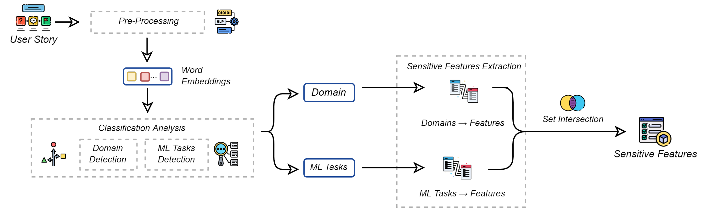
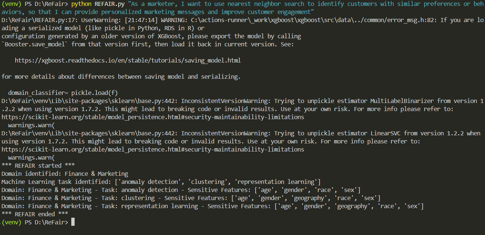
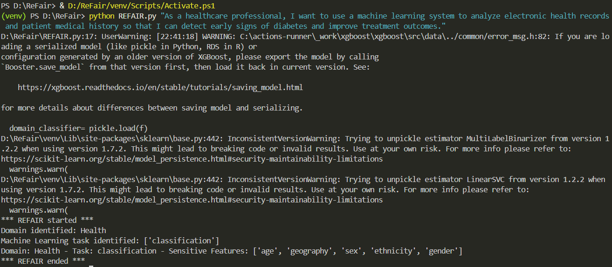

# ReFAIR - Context-Aware Fairness Recommender in Requirement Engineering  

ReFAIR es una herramienta que ayuda a identificar **dominios de aplicación**, **tareas de Machine Learning** y **atributos sensibles** a partir de historias de usuario escritas en lenguaje natural.  
Su objetivo es **detectar posibles riesgos de sesgo y discriminación** desde la fase de requisitos en proyectos de Machine Learning.  


---

## Instalación  

1. Clonar el repositorio:  
   ```bash
   git clone https://github.com/usuario/REFAIR.git
   cd REFAIR

2. Crear entorno virtual (recomendado):
    ```bash
     python -m venv venv
     venv\Scripts\activate   # En Windows PowerShell

3. Instalar dependencias:
     ```bash
     pip install -r requirements.txt
     
4. Descargar GloVe embeddings (necesarios para la clasificación multi-etiqueta):
   - Ir a GloVe
   - Descargar glove.6B.zip
   - Descomprimir y colocar el archivo glove.6B.100d.txt en la carpeta models/ de este proyecto.

## Uso
Ejecuta ReFAIR pasando una historia de usuario como parámetro:


Comando:

`python REFAIR.py "As a [role], I want [function] so that [benefit]."`

## Ejemplos de pruebas
# Ejemplo 1: Loan Approval (Finanzas)

`python REFAIR.py "As a loan officer, I want to use a machine learning system to predict if a customer is eligible for a loan so that I can automate credit approval."`


# Ejemplo 2: Healthcare (Diabetes Prediction)

`python REFAIR.py "As a healthcare professional, I want to use a machine learning system to analyze electronic health records so that I can detect early signs of diabetes and improve treatment outcomes."`


